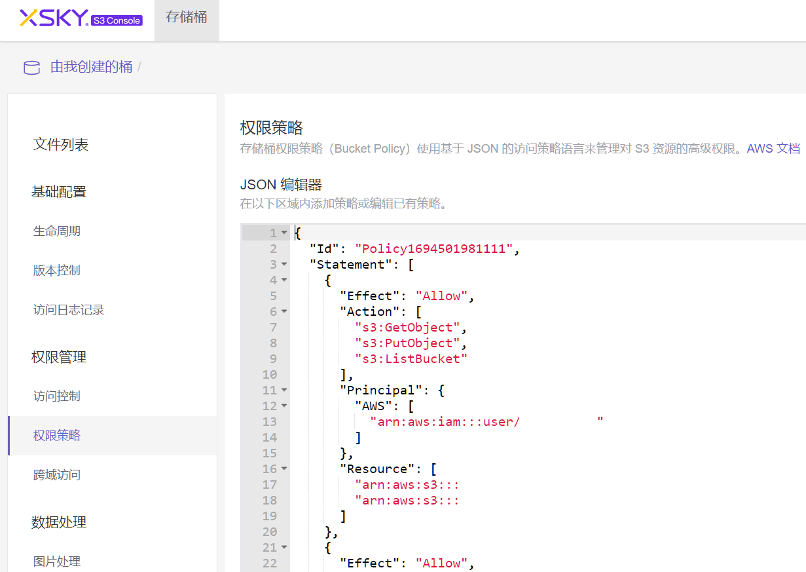

## 样例

```yaml
{
  "Id": "Policy1694501981111",
  "Statement": [
    {
      "Effect": "Allow",
      "Action": [
        "s3:GetObject",
        "s3:PutObject",
        "s3:ListBucket"
      ],
      "Principal": {
        "AWS": [
          "arn:aws:iam:::user/[用户名]"
        ]
      },
      "Resource": [
        "arn:aws:s3:::[桶名]",
        "arn:aws:s3:::[桶名]/[路径]/*"
      ]
    }
  ]
}
```

## 说明

配置菜单：S3 Console --> 权限管理 --> 权限策略

若保存失败，去掉参数中的Id字段


